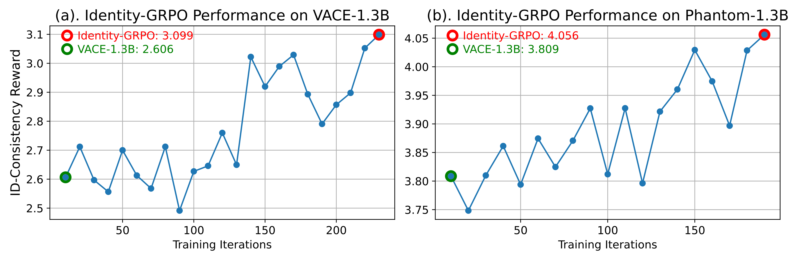
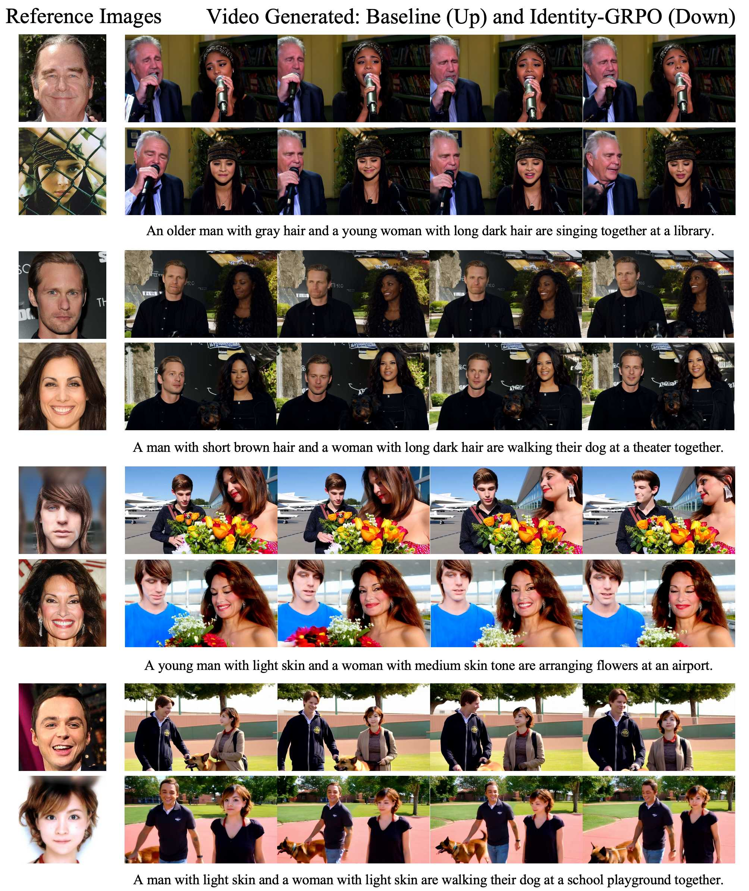

<h1 align="center"> Identity-GRPO:<br>Optimizing Multi-Human
Identity-preserving Video Generation via
Reinforcement Learning </h1>

<div align="center">
Xiangyu Meng*, Zixian Zhang*, Zhenghao Zhang, Junchao Liao, Long Qin, Weizhi Wang

\* equal contribution

<div align="center">
  <a href='https://arxiv.org/abs/2510.14256'></a>
  <a href='https://ali-videoai.github.io/identity_page/'></a>
  <a href="https://github.com/alibaba/identity-grpo"></a>
</div>

</div>


## 💡 Abstract
While advanced methods like VACE and Phantom have advanced video generation for specific subjects in diverse scenarios, they struggle with multi-human identity preservation in dynamic interactions, where consistent identities acrossmultiple characters are critical. To address this, we propose a human feedback-driven optimization pipeline for refining multi-human identity-preserving videogeneration. First, we construct a video reward model trained on a large-scale preference dataset containing human-annotated and synthetic distortion data, with pairwise annotations focused on maintaining human consistency throughout the video. We then introduce Identity-GRPO, a GRPO variant tailored for multi-human consistency, which greatly enhances both VACE and Phantom. Through extensive ablation studies, we evaluate the impact of annotation quality and design choiceson policy optimization. Experiments show that Identity-GRPO achieves up to 18.9% improvement in human consistency metrics over baseline methods, offering actionable insights for aligning reinforcement learning with personalized videogeneration. 


## 🚀 Quick Started
### 1. 🐍 Environment Set Up
Clone this repository and install packages.
```bash
git clone https://github.com/alibaba/identity-grpo.git
cd identity_grpo
conda create -n vace_grpo python=3.10.16
conda activate vace_grpo
pip install -e .

# Then you should download FlashAttention2 and install it.
pip install flash_attn-2.7.4.post1+cu12torch2.6cxx11abiFALSE-cp310-cp310-linux_x86_64.whl
```

### 2. 📦 Model Download
#### Weights Folder Structure

```
identity_grpo
└── outputs
    └── identity_grpo
    |   ├── ckpt
    |   │   └── vace
    |   │       └── lora/
    |   ├── logs
    |   │   └── vace
    |   ├── save_video_test
    |   │   └── vace
    |   |── save_video_train
    |   │   └── vace
    └── identity_reward
        ├── checkpoint-xxx/
        ├── config.json
        └── model_config.json
```

#### Download Links
First, you need to download `Wan-AI/Wan2.1-VACE-1.3B-diffusers` and `Qwen/Qwen2.5-VL-3B-Instruct` from huggingface.com.

Identity-GRPO lora weights: [Link](https://cloudbook-public-daily.oss-cn-hangzhou.aliyuncs.com/identity_grpo/lora_best.tgz). Unzip this finetuned lora weights in `outputs/identity_grpo/ckpt/vace/`. 

Identity-reward weights: [Link](https://cloudbook-public-daily.oss-cn-hangzhou.aliyuncs.com/identity_grpo/identity_reward.tgz). Unzip this reward weights in `outputs/identity_reward` directly. 

Then, you can set the pretrained model path and reward_model path in `config/dgx.py`. 

### 3. 🏁 Data Preparation
Following the  format of `train.csv and test.csv` in `dataset/generated_img`, you can prepare your own dataset.

Then, you can set your dataset path in `config/dgx.py`.

### 4. 🔄 Inference
First, you need to modify `train.lora_path` in `config/base.py` to the finetuned grpo weight path:
```python
# lora path
train.lora_path = "outputs/identity_grpo/ckpt/vace/lora" 
```

And you need to prepare the test data in `dataset/generated_img/test.csv`. 

Then run the scripts: 
```bash
accelerate launch --config_file scripts/accelerate_configs/multi_gpu.yaml --num_processes=1 --main_process_port 29501 test_wan2_1_vace.py --config config/dgx.py:vace
```

You can refer to [scripts/single_node/test.sh](scripts/single_node/test.sh) for more configuration parameters.

#### 4.1. Identity-Reward Inference
If you only need to use the Identity-Reward model, you can refer to [vace_reward/inference.py](vace_reward/inference.py) .

### 5. 🧠 Training
You can prepare the training data in `dataset/generated_img/train.csv`, and set the dataset path in `config/dgx.py`. 

Then run the scripts: 
```bash
CUDA_VISIBLE_DEVICES=0,1,2,3,4,5,6,7 accelerate launch --config_file scripts/accelerate_configs/multi_gpu.yaml --num_processes=8 --main_process_port 29502 train_wan2_1_vace.py --config config/dgx.py:vace
```

You can refer to [scripts/single_node/train.sh](scripts/single_node/train.sh). More training configuration can be found in `config/dgx.py`.

Using the provided configuration, the resulting ID-Consistency reward curves of Identity-GRPO on VACE-1.3B and Phantom-1.3B are shown below. Both exhibit a clear upward trend. 
<p align="center">
  
</p>

## 🎞️ Showcases
<p align="center">
  
  <!-- width="350" -->
</p>

All videos are available in this [Link](https://ali-videoai.github.io/identity_page)

## 🤝 Acknowledgements

This repo is based [Flow-GRPO](https://github.com/yifan123/flow_grpo), [VideoAlign](https://github.com/KwaiVGI/VideoAlign), [Wan2.1](https://github.com/Wan-Video/Wan2.1), [VACE](https://github.com/ali-vilab/VACE) and [Phantom](https://github.com/Phantom-video/Phantom). We thank the authors for their valuable contributions to the AIGC community. 

## 📄 Our previous work
- [Tora2: Motion and Appearance Customized Diffusion Transformer for Multi-Entity Video Generation](https://ali-videoai.github.io/Tora2_page/)
- [Tora: Trajectory-oriented Diffusion Transformer for Video Generation [CVPR 2025]](https://github.com/alibaba/Tora)
- [AnimateAnything: Fine Grained Open Domain Image Animation with Motion Guidance](https://github.com/alibaba/animate-anything)


## ⭐Citation
If you find Identity-GRPO useful for your research or projects, we would greatly appreciate it if you could cite the following paper:
```
@misc{meng2025identitygrpooptimizingmultihumanidentitypreserving,
      title={Identity-GRPO: Optimizing Multi-Human Identity-preserving Video Generation via Reinforcement Learning}, 
      author={Xiangyu Meng and Zixian Zhang and Zhenghao Zhang and Junchao Liao and Long Qin and Weizhi Wang},
      year={2025},
      eprint={2510.14256},
      archivePrefix={arXiv},
      primaryClass={cs.CV},
      url={https://arxiv.org/abs/2510.14256}, 
}
```
